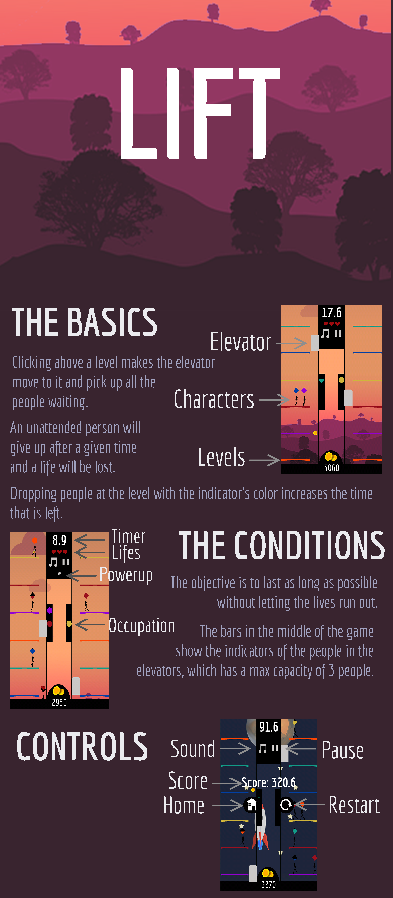

# LPOO_T4G3

**Group Members:**

Antero Campos Gandra 201607926 up201607926@fe.up.pt

Guilherme José Ferreira do Couto Fonseca da Silva 201603647 up201603647@fe.up.pt

## Mockup

## Setup

  * ### Android
    **APK**: [APK](https://drive.google.com/open?id=1CB2SmrCA250k_zOOSifG5IOc9Z1YOUZF)
    
  * ### Development environment
    1. Clone this repository and open with gradle in an IDE.
    2. Change the working directory to the assets folder in the android module.
    
    **Warning**: As of 02/06/2018, the Desktop and Unit Tests were not running in IntelliJ or Android Studio, due to incompatibilities
## UML

## Design Patterns

 * ### Model-View-Controller
   This pattern is the base architectural design for the game.
   
   * **Model**: Holds all the information to be displayed in the game.
   * **View**: Displays the game with the information of the model, also gathers user input.
   * **Controller**: Responsible for the control of the game.
 
 * ### Singleton
   A singleton is used  for the class TextureManager, this class was chosen to be a singleton due to the high number of entry points and the existence of a single instance of it during runtime.
  
 * ### Template Method
   The base control of the power up is made in the function update of the abstract classes BasicPowerUp and TimedPowerUp.
   This facilitates the creation of new power ups as they only the effects of the power up need to programmed.
 
 * ### Strategy
   The people do not own any strategy directly, instead exists a strategy selector which is called when an action needs to take place.
   This selector takes the types of the person/people involved into consideration.
   
   The existence of this selector eliminates the necessity for an equivalent object for each person of the same type.
   
 * ### Null Object
     Null object classes: NullStrategy,NullPU, NullServices.
                     
 * ### Update Method
     All the game objects that do are not controlled by the physics engine have an updates method that advances they status base on the changes tp the game  and the time that passed.

## Not Implemented
   
 * **Theme Changer**: The ability to change and buy themes using in game currency.
 * **Ads**: We wanted to introduce the ability to be continue a game after it ended by watching an Ad.
 * **Performance Improvements**
    * List of new people: Avoiding iterating through all the people.
    * Add listener to the elevator: so people leave when they reach instead of searching all the people ofr those who have to leave.
    
## Time spent
 
The total time spend on the development must be between the 100 and 150 hours.

## Difficulties
 * **Implementing google play services**: As google changed some things about its API in the months leading to the development of this project,
 there was no clear instructions to integrate it with LibGdx, so we had to play with the code given by google as an example until we found a solution it worked.
 
## What we learned
The importance of leaving the classes open to expansion so new features can be easily added. 
